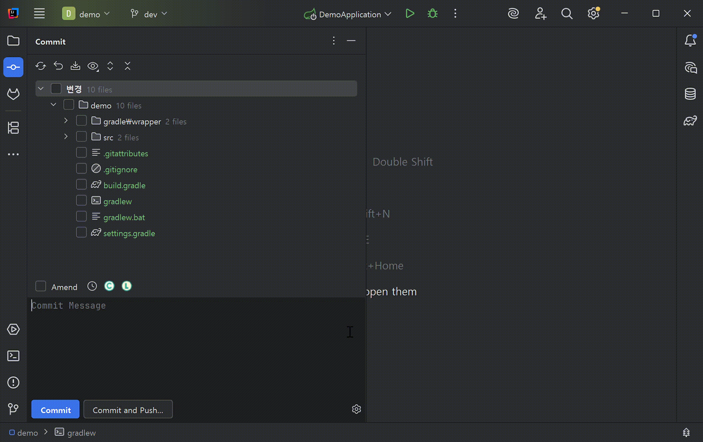
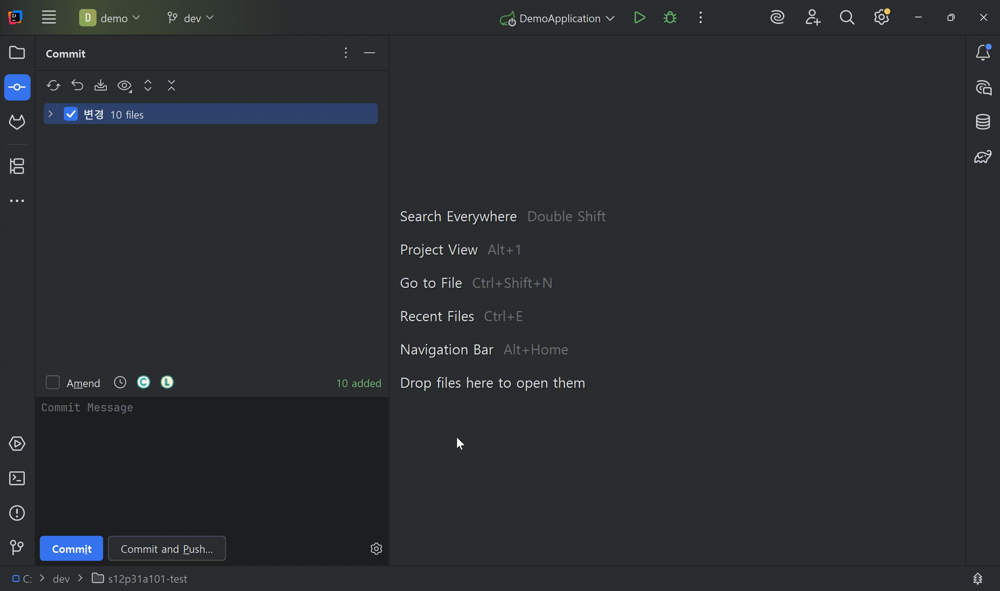
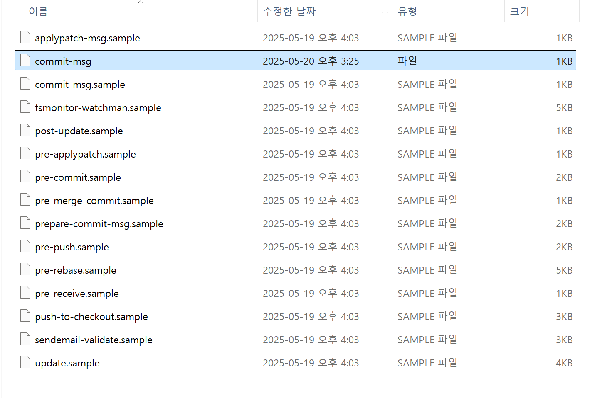
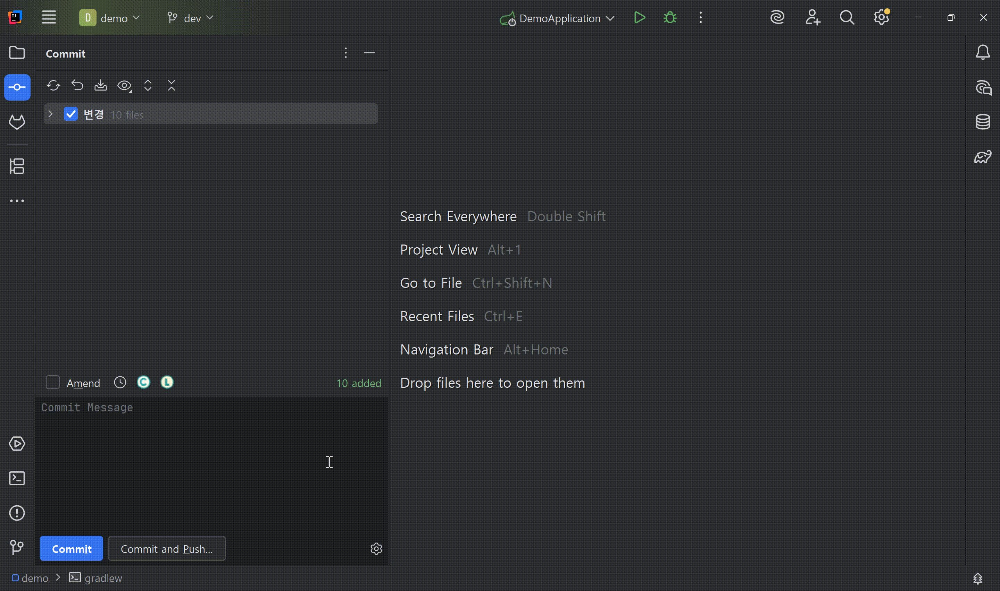
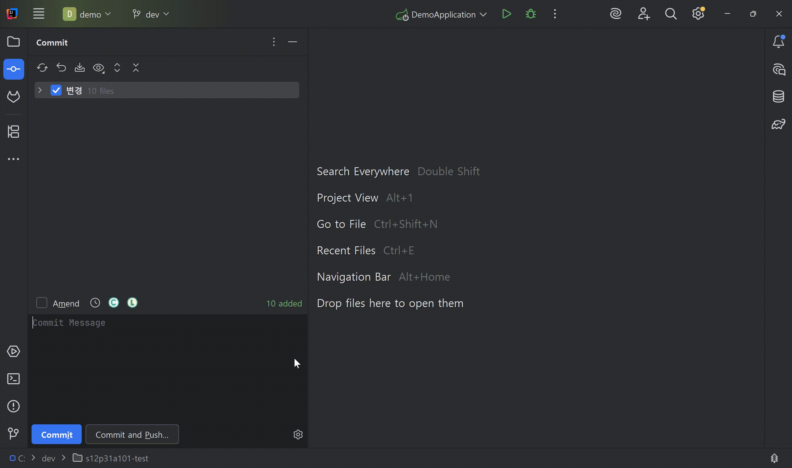
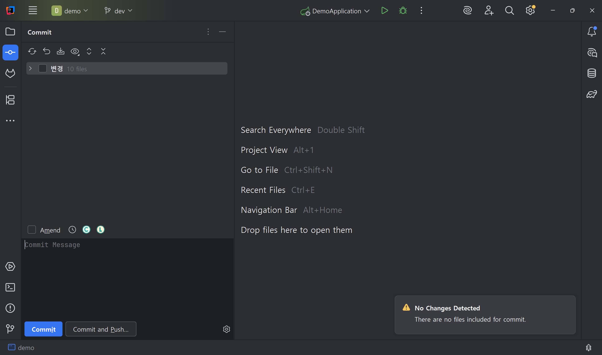

# Convi Commit Buddy

<!-- Plugin description -->
Convi의 Commit Buddy는 LLM을 활용해 정해진 커밋 컨벤션에 맞는 Git 커밋 메시지를 작성할 수 있도록 도와주는 플러그인입니다.

주요 기능:

* 정규식(regex)으로 커밋 메시지 컨벤션 설정
* 스테이징된 diff를 기반으로 커밋 메시지 추천
* 다양한 LLM 모델 지원
* Git Hook을 자동으로 생성하여 커밋 메시지 린트 적용
* IDE 내 커밋 패널 UI에 통합하여 간편한 사용

컨벤션을 준수하는 일관된 커밋 메시지로 Git 워크플로우를 개선해보세요.

<!-- Plugin description end -->

---

## 개요

Convi Commit Buddy는 개발자가 명확하고 일관된 Git 커밋 메시지를 작성할 수 있도록 도와주는 IntelliJ 플러그인입니다.
스테이징된 변경 내용을 분석한 후, LLM을 활용해 관련된 커밋 메시지를 커밋 패널 안에서 직접 추천합니다.

또한 정규식으로 커밋 메시지 컨벤션을 설정하면, 해당 규칙을 기반으로 Git Hook 파일을 자동으로 생성하여 린트 기능을 제공합니다.
입력한 컨벤션에 따라 커밋 메시지도 함께 추천받을 수 있어, 별도의 도구 없이도 일관된 메시지 작성이 가능합니다.

로컬 LLM(Ollama)이나 클라우드 기반(OpenAI) 모델을 선택해 사용할 수 있으며, 
커밋 옵션 설정에서 쉽게 전환할 수 있습니다.

---

## 주요 기능

* 정규식(regex)으로 커밋 메시지 컨벤션 설정
* 스테이징된 diff를 기반으로 커밋 메시지 추천
* 다양한 LLM 모델 지원
* Git Hook을 자동으로 생성하여 커밋 메시지 린트 적용
* IDE 내 커밋 패널 UI에 통합하여 간편한 사용

---

## UI 통합

### 커밋 패널

커밋 패널에 새로운 옵션 그룹이 추가되어 다음 기능을 제공합니다:

* LLM 모델 선택 (예: Ollama, ChatGPT)
* API KEY 입력
* Regex 입력
* 커밋 메시지 자동 생성 트리거
* Git Hook 파일 생성

설정은 프로젝트 단위로 저장되어, 다중 프로젝트 환경에서도 유연하게 사용할 수 있습니다.

---

## 사용하기

### 1. 플러그인 설치

`Settings` > `Plugins` > `⚙️` > `Install Plugin from Disk...` 메뉴로 이동합니다.

빌드된 `.zip` 형식의 플러그인 파일을 선택합니다.

(선택 사항) 설치 후, 변경 사항을 반영하기 위해 IDE를 재시작합니다.

### 2. 커밋 린트 적용하기

커밋 옵션 패널에서 커밋 메시지 컨벤션을 위한 정규식(Regex) 을 입력합니다.

커밋 패널의 L 아이콘을 클릭하여 git hook 파일을 생성합니다.

생성된 `commit-msg` 파일은 `.git/hooks/` 디렉토리에서 확인할 수 있습니다.

실제 커밋 메시지를 입력해 린트가 정상적으로 동작하는지 확인합니다.

### 3. 커밋 메시지 추천받기

사용할 LLM 모델(예: Ollama, ChatGPT)을 선택합니다.

(선택사항) ChatGPT를 사용할 경우 API 키를 입력합니다.

커밋 패널의 C 아이콘을 클릭하여 추천 메시지를 생성합니다.

> **주의 사항**
> 
> 변경 사항이 선택되지 않으면 커밋 메시지 추천 기능이 동작하지 않습니다.
> 
> 

---

## 시스템 요구사항

* IntelliJ IDEA 2022.3 이상 또는 호환 가능한 JetBrains IDE

* Ollama 사용시:

  * Ollama는 로컬에서 `http://localhost:11434` 주소로 실행 중이어야 합니다.
  * 지원 모델: `llama3.2`

* ChatGPT 사용시:

  * 유효한 OpenAI API KEY 필요

---

## 기여하기

Convi Commit Buddy는 여러분의 기여를 환영합니다!
버그 제보, 기능 제안, Pull Request 제출 등 어떤 형태든 소중한 기여입니다.

코드, 문서, 아이디어 등 다양한 형태의 기여에 감사드립니다! 🙌