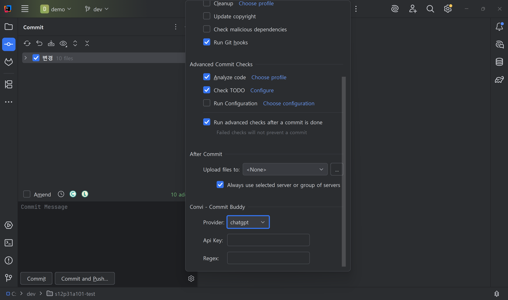

# Convi Commit Buddy

<!-- Plugin description -->
Convi Commit Buddy helps you write meaningful Git commit messages using large language models.

Features:
- Suggests commit messages based on code diffs
- Supports multiple providers
- Integrates into the commit panel of IntelliJ-based IDEs

Improve your Git workflow by generating consistent and context-aware messages.
<!-- Plugin description end -->

---

## Overview

Convi Commit Buddy is an IntelliJ plugin designed to help developers generate clear and consistent Git commit messages.  
By analyzing your staged changes, the plugin uses a Large Language Model (LLM) to suggest relevant commit messages directly inside the commit panel.

Whether you’re using a local LLM like Ollama or a hosted provider like OpenAI, Convi lets you configure and switch providers easily.

---

## Key Features

- Generate commit messages using staged diffs and LLMs
- Integrated with the commit panel UI (no need to leave your IDE)
- Supports both local (Ollama) and remote (ChatGPT/OpenAI) providers
- Configure API keys and models per project
- Minimal UI footprint and intuitive configuration

---

## UI Integration

### Commit Panel

A new option group appears in the commit panel, allowing you to:

- Select a provider (e.g., Ollama, ChatGPT)
- Input or update API keys
- Trigger commit message generation

Settings are saved per project to support flexible multi-project workflows.

---

## Requirements

- IntelliJ IDEA 2022.3+ or any compatible JetBrains IDE
- For Ollama users:
    - Ollama must be running locally at `http://localhost:11434`
    - Supported models: `llama3.2`.
- For ChatGPT users:
    - Requires a valid OpenAI API key

---

## Installation

You can download this plugin from the [JetBrains Marketplace](https://plugins.jetbrains.com/).

---

## Contributing
We welcome contributions to Convi Commit Buddy!
If you'd like to report a bug, suggest a feature, or submit a pull request, please follow the contribution guidelines.

All contributions—whether code, documentation, or ideas—are appreciated! 🙌