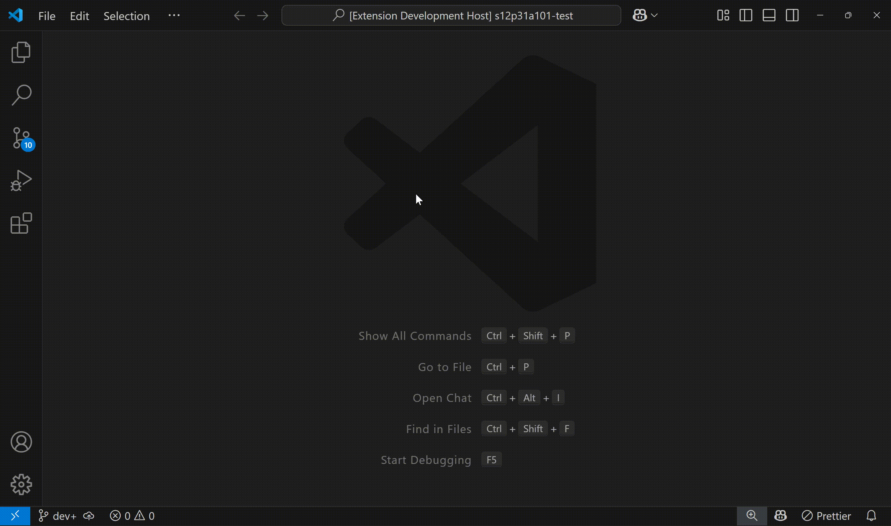
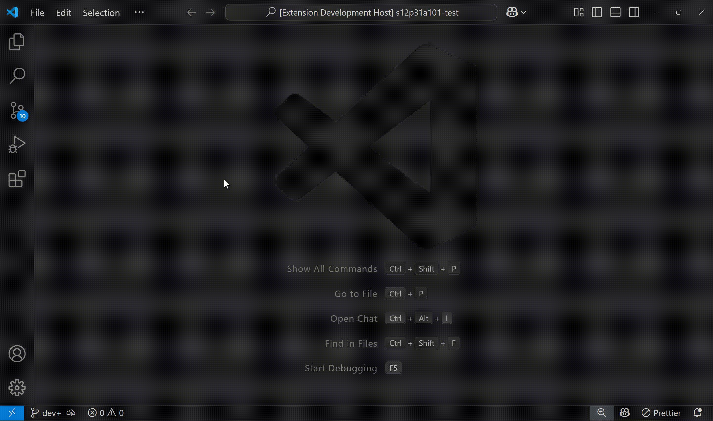
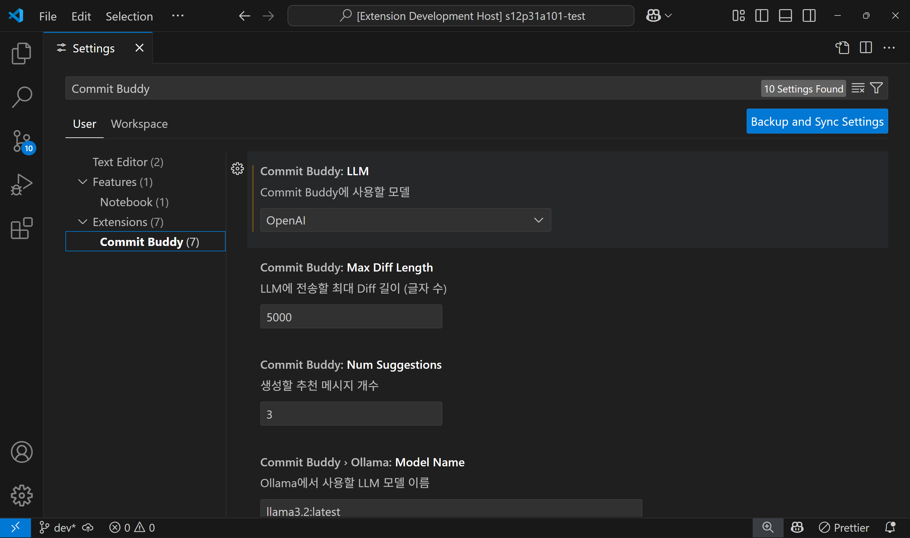
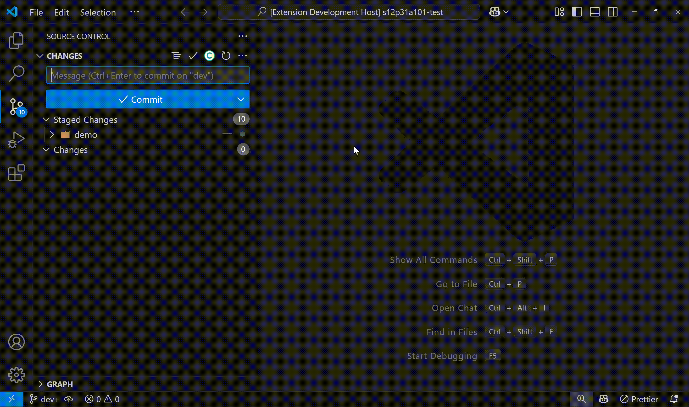
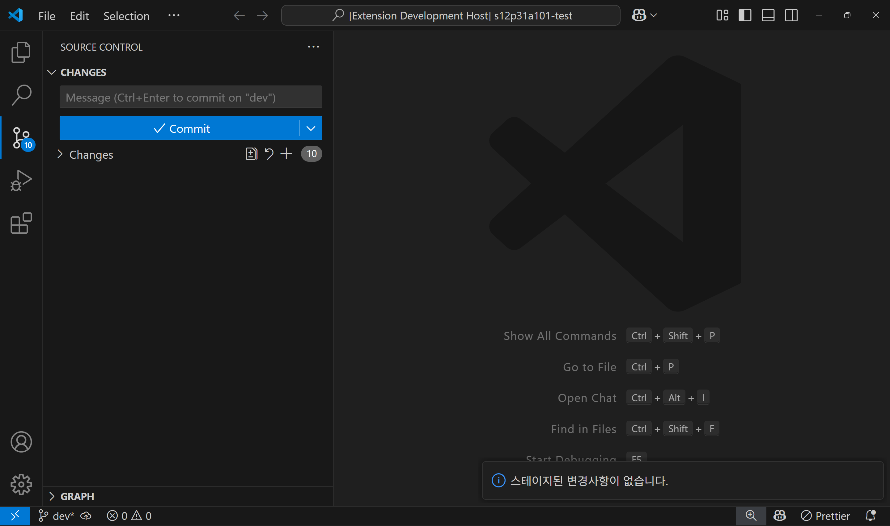

# Commit Buddy - Git 커밋 메시지 도우미

Convi의 Commit Buddy는 LLM을 활용해 정해진 커밋 컨벤션에 맞는 Git 커밋 메시지를 작성할 수 있도록 도와주는 VS Code 확장 프로그램입니다. 

Git과 협업 컨벤션에 익숙하지 않은 개발자들이 일관된 형식의 커밋 메시지를 작성할 수 있도록 도와줍니다. 컨벤션을 준수하는 일관된 커밋 메시지로 Git 워크플로우를 개선해보세요.

## 주요 기능

- 정규식(regex)으로 커밋 메시지 컨벤션 설정
- Git Hook을 자동으로 생성하여 커밋 메시지 린트 적용
- AI 기반으로 스테이징된 변경사항 분석 후 커밋 메시지 추천
- Conventional Commits 형식 지원 (feat, fix, docs, style 등)
- Ollama 기반 로컬 LLM 모델과 OpenAI API 활용
- VS Code UI와 통합된 간편한 사용 경험 제공

## 사용하기

### 1. 확장 프로그램램 설치

VS Code 좌측 사이드바에서 Extensions 탭을 클릭합니다.

Commit Buddy를 검색하여 Extension을 설치합니다.

(선택 사항) 설치 후 VS Code를 재시작합니다.

### 2. 커밋 린트 적용하기



Commit Buddy 설정에서 커밋 컨벤션에 사용할 정규식을 입력합니다.

> VS Code 좌측 사이드바 하단에 ⚙️ > Settings > Commit Buddy 검색

`Ctrl + Shift + P` 로 커맨드 입력창을 열어 `Commit Buddy: 커밋 메시지 컨벤션 설정`을 실행합니다.



`.git/hooks/commit-msg` 파일이 생성되었는지 확인하고, 커밋 시 린트가 정상적으로 동작하는지 테스트합니다.

> 플러그인 설정에서 다양한 값을 바꿀 수 있습니다.
>
> 

### 3. 커밋 메시지 추천받기



SOURCE CONTROL 탭의  아이콘을 클릭하여 추천 메시지를 생성합니다.

추천 결과 중 원하는 메시지를 선택하여 커밋 메시지 입력란에 적용합니다


> 주의 사항
> 
> 변경 사항이 스테이징되지 않으면 커밋 메시지 추천 기능이 동작하지 않습니다.
> 
> 


## 개발 환경 설정

```bash
# 의존성 설치
npm install

# TypeScript 컴파일
npm run compile

# 개발 모드로 실행 (VS Code에서 F5)
```

## 요구사항

- VS Code 1.99.0 이상
- Git 설치
- Ollama 설치 및 실행 (기본 모델: llama3.2:latest)
- ChatGPT 사용시 유효한 OpenAI API KEY 필요

## Convi 프로젝트

이 확장 프로그램은 Convi 프로젝트의 일부로, Git과 협업에 익숙하지 않은 초보 개발자들을 위한 AI 기반 자동화 도우미 시리즈 중 하나입니다.

## 라이센스

MIT