# Review Buddy

### Review Buddy?
- **Review Buddy**는 **Gitlab MergerRequest** 요청 시 **Gitlab Request API, AI(Ollama, GPT)** 기반으로 자동 코드 리뷰를 작성하는 서비스입니다.
    - 해당 서비스를 적용하기 위해 **Gitlab Runner** 사전 작업이 필요하며, .gitlab-ci.yml를 프로젝트 루트에 위치시켜야 합니다.
- Gitlab Runner를 로컬 혹은 운영환경에서 동작시키고, 이후 .gitlab-ci.yml이 존재하는 Branch에서 MR 요청 시 Gitlab Pipeline을 통해 Docker Image를 실행시키며, 해당 Docker Image는 RAG 기반 AI 코드 리뷰를 제공합니다.

<br><br>

## Review Buddy 구성 요소
### 1. <code>Gitlab Runner</code>
### 2. <code>.gitlab-ci.yml</code>
### 3. <code>review-buddy Docker Image</code>

<br>

### Gitlab Runner?
<details>
<summary><b>설명</b></summary>

- Gitlab Runner는 Gitlab Pipeline에서 동작이 필요한 작업을 자동으로 실행하고, 해당 정보를 Gitlab으로 보내주는 역할을 합니다.
- 자동으로 AI 코드 리뷰를 하기 위해서는 작업을 진행할 Gitlab Runner가 **로컬 환경 혹은 운영 환경**에서 실행 중이어야 합니다.
    - Gitlab Runner가 로컬 환경에서 실행되는 경우, 현재 로컬 환경이 실행되고 있지 않고 팀원이 MR 요청을 한다면 Gitlab Runner가 실행되는 로컬 환경이 제공되지 않아 실행되지 않아 운영 환경에서 실행하는 것을 권장합니다.
- 지속적인 코드 리뷰를 원한다면 특정 환경에서 Gitlab Runner를 지속적으로 실행되어야 합니다.
</details>

<br>

### .gitlab-ci.yml?
<details>
<summary><b>설명</b></summary>

- 해당 파일은 파이프라인 설계도로서 GitLab CI/CD가 **'어떤 작업(Job)을 언제, 어떤 Runner에서 실행할지'** 를 정의합니다.
- Gitlab CI 발생 시 자동으로 참조하며, **Gitlab CI/CD Variables** 환경 변수 정보를 주입할 수 있습니다.
- Gitlab에서 자동으로 '.gitlab-ci.yml'를 파싱하여 사전에 Gitlab CI/CD Variables에 등록한 **<code>GITLAB_TOKEN</code>, <code>OPEN_AI_KEY</code>, <code>REVIEW_BUDDY</code>** 환경 변수 정보들을 받아와 Public Docker Image를 실행시켜 코드 리뷰 정보를 응답받습니다.
- 약간의 설정 수정을 통해 LLM 모델을 **Ollama 혹은 GPT**를 사용하도록 선택하거나, **RAG 사용 여부**를 선택할 수 있습니다.
</details>

<br>

### Review Buddy Docker Image?
<details>
<summary><b>설명</b></summary>

- **LangChain 환경의 RAG 기반**으로 코드 리뷰 환경을 쉽게 구축하고, 실행하기 위해 Review Buddy는 **Public Docker Image**를 사용하여 AI 코드 리뷰를 진행합니다.
- 제공되는 Docker Image는 Gpt-4o Image, Ollama 3.2 + Gpt-4o Image를 선택할 수 있습니다.
    - **os2864/review-buddy:v0.1.3** : 중량급 LLM인 Ollama 3.2 + Gpt-4o 코드 리뷰 이미지 (3.76GB)
    - **os2864/review-buddy-gpt:v0.1.1** : Gpt-4o 경량 코드 리뷰 이미지 (226MB)
- 이미지 실행 시 각각 6 ~ 8GB, 300 ~ 500MB 으로 사용 시, Runner 실행 환경에서 처음 Pull시 해당 용량 만큼의 공간을 확보해야합니다.
- RAG는 **chromadb** 라이브러리를 사용하며, 저장된 임베딩 파일 중 **코사인 유사도 상위 5개**의 파일을 참조합니다.
</details>

<br><br>

### 동작 순서
1. Gitlab Runner를 로컬 환경 혹은 운영 환경에서 실행시킵니다.
2. 프로젝트 루트에 'gitlab-ci.yml'를 추가합니다.
3. Gitlab에서 CI 발생시 자동으로 '.gitlab-ci.yml'을 파싱하여 Pipeline 객체를 생성하며, 해당 객체 생성시 GitLab이 자동으로 객체 안에 Job N개를 ‘pending’ 상태로  'Pending-Job 대기열'에 집어넣습니다.
4. Gitlab Runner가 지속적인 Polling을 통해 Gitlab 대기열의 작업이 있다고 판단하면, 작업을 가져오고 상태를 'Running' 상태로 변경합니다.
5. '.gitlab-ci.yml' 설정에 맞게 Review Buddy Docker Image를 실행시키며 완료 시 응답을 반환합니다.
6. Gitlab Pipeline 성공시, 해당 MR에 리뷰가 성공적으로 작성됩니다.

<br><br>

## 사용 방법

### 1. Gitlab Runner 컨테이너 생성 및 실행

### 1-1. Runner 생성

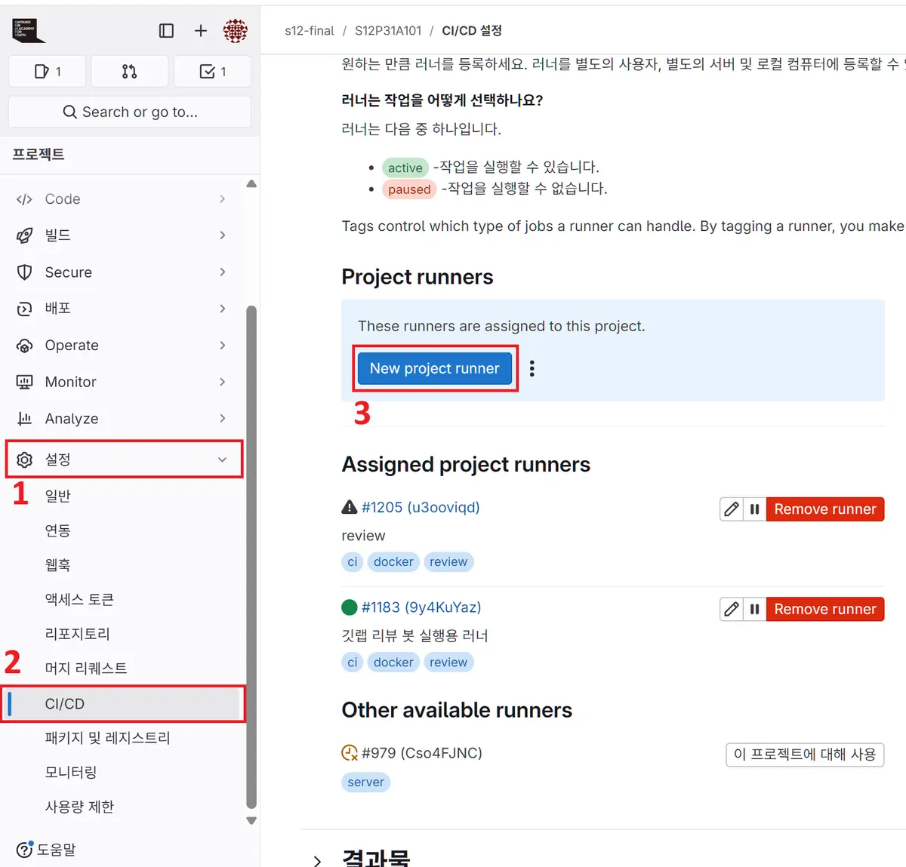

- Gitlab Runner 생성을 위해 <code>설정 -> CI/CD -> Runner -> New project runner</code> 버튼을 클릭합니다.

<br><br>

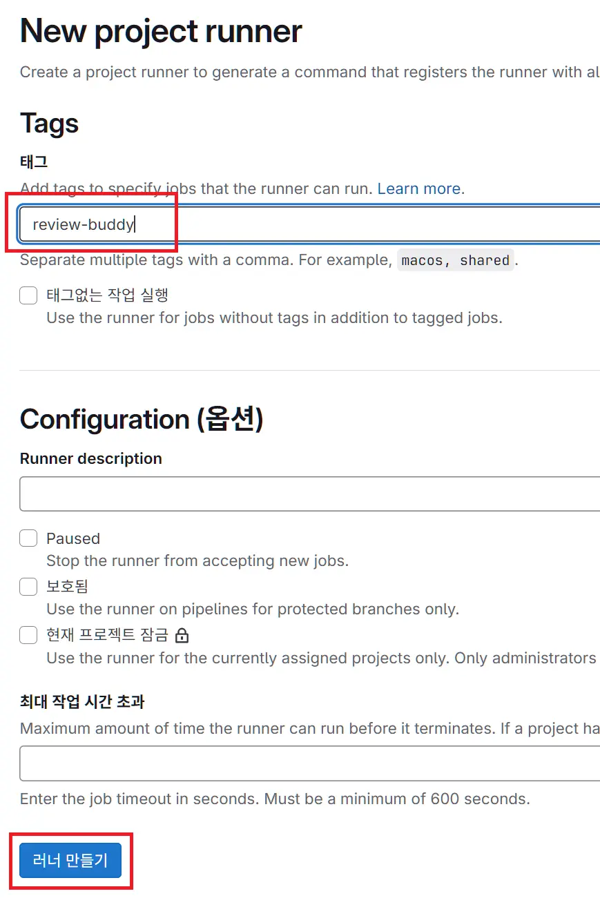

- Runner 실행 태그를 등록합니다. 등록된 태그의 Job을 실행하기 위한 용도입니다.

<br><br>

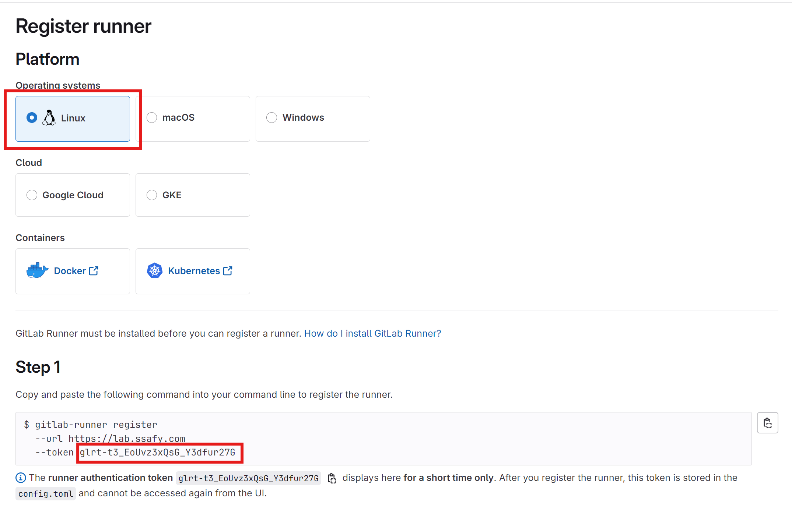

<br>

| 변수명              | 용도 / 설명 | 지정 방법 |
|--------------------|-------------|-----------|
| `gitlab_runner_token` | GitLab **New project runner** 화면 *Step 1* 에서 복사한 Registration Token | 아래 Runner 설정 명령어에 직접 치환 <br> 혹은 Runner 사용 환경에서 <code>export gitlab_runner_token=…</code> 후 명령 실행 |
| `gitlab_url` |  Runner를 등록할 GitLab 인스턴스 URL (예: <code>https://lab.ssafy.com</code>) |  Runner 설정 명령어에 직접 치환 <br> 혹은 Runner 사용 환경에서 <code>export gitlab_url=…</code> 후 명령 실행 |

<br>

- Docker Container에서 Runner를 실행한다면 Docker 실행 환경 플랫폼을 선택하고, Step1 코드 블록 내의 token 정보와 gitlab_url 정보를 복사합니다.
- 해당 정보는 아래 `${gitlab_runner_token}`, `${gitlab_url}` 값으로 사용됩니다.
  - Docker Desktop의 디폴트 실행환경은 <code>Linux</code> 입니다.
  - Docker Container를 사용한다면 컨테이너 생성 및 실행 명령어는 <b>[1-2](#1-2-runner-컨테이너-생성-및-실행), [1-3](#1-3-runner-정보-최초-등록)</b>에 존재합니다.
- 만약 Docker Container로 동작시키지 않는다면, 실행 환경 OS 플랫폼을 선택하고 <b>[1-4](#1-4-선택-docker없이-runner-설치-및-설정하기)</b> 과정으로 건너뛰어 진행합니다.

<br><br>

### 1-2. Runner 컨테이너 생성 및 실행

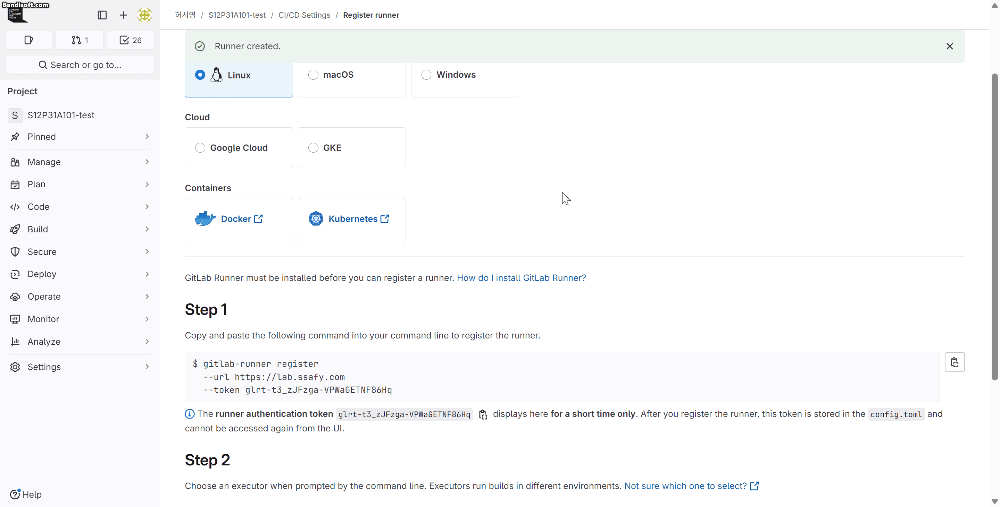

- 해당 명령어를 Runner를 실행시킬 환경(로컬 혹은 운영 환경)에서 실행하여 Runner 컨테이너 생성 및 실행합니다. 사용 중인 터미널 환경에 따라 아래 명령어 중 하나를 실행하세요.
- 만약 위에서 컨테이너로 Runner를 실행하지 않고, OS에서 직접 실행한다면, 해당 <b>[1-2](#1-2-runner-컨테이너-생성-및-실행), [1-3](#1-3-runner-정보-최초-등록)</b> 과정은 건너뜁니다.

```bash
docker run -d --name gitlab-runner --restart always -v /opt/gitlab-runner/config:/etc/gitlab-runner -v /var/run/docker.sock:/var/run/docker.sock gitlab/gitlab-runner:latest

```

<br><br>

### 1-3. Runner 정보 최초 등록

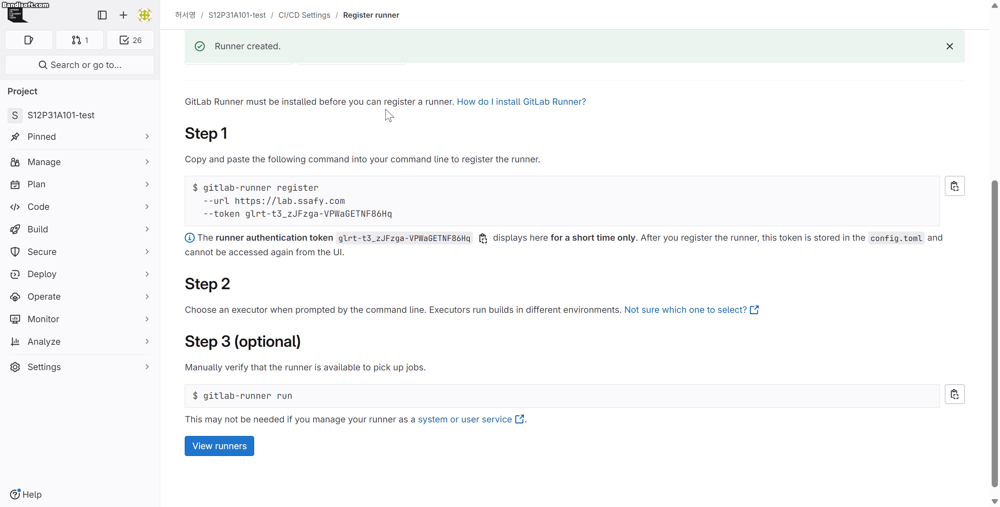


- Runner를 Gitlab Repository와 연동하기 위한 최초 정보를 등록합니다. 사용 중인 터미널 환경에 따라 아래 명령어 중 하나를 실행하세요.
- 해당 명령어를 Runner를 실행시킬 환경에서 실행 시, <code>${gitlab_runner_token}</code> 의 값을 Gitlab Runner Token 값으로 변경해주세요.
- 또한, <code>${gitlab_url}</code> 의 값도 Gitlab Url 값으로 변경해주세요.

```bash
docker exec -i gitlab-runner gitlab-runner register --non-interactive --url "${gitlab_url}" --token "${gitlab_runner_token}" --executor "docker" --docker-image "docker:latest" --name "ci-docker-runner"
```

<br><br>

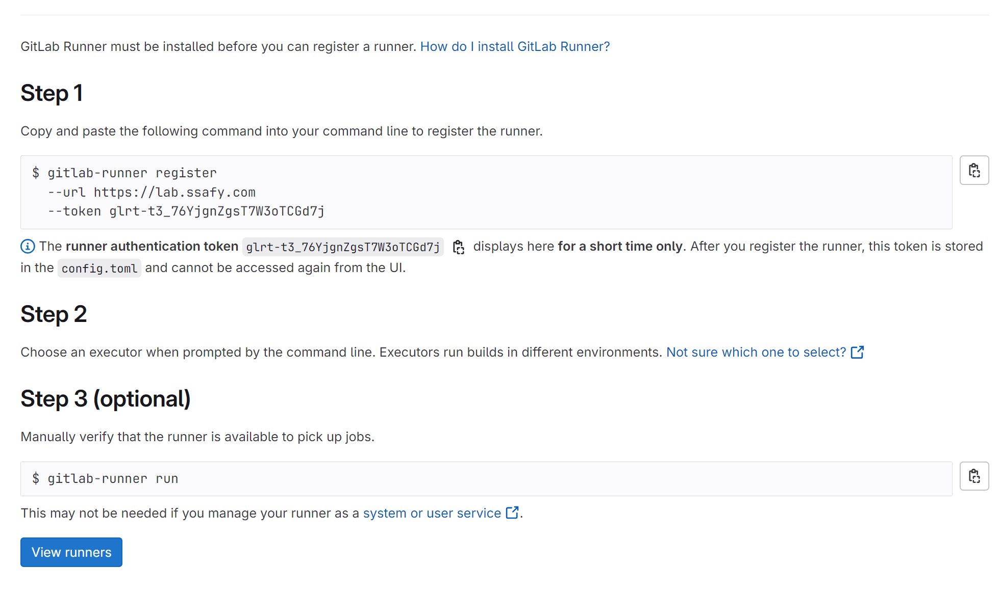

<br>

### 1-4. (선택) Docker없이 Runner 설치 및 설정하기
- Docker 없이 Runner를 설치한다면 다음 명령어 순서를 따릅니다.
- 실행 환경의 플랫폼을 선택하면 해당 플랫폼에 맞춰 Docker Gitlab 설정 명령어가 변경됩니다.
- Gitlab Runner를 먼저 설치하고, 이후 Gitlab 화면의 Step1, Step2, Step3의 명령어를 그대로 실행합니다.

<br>

### 1-5. Runner 등록 성공 및 확인

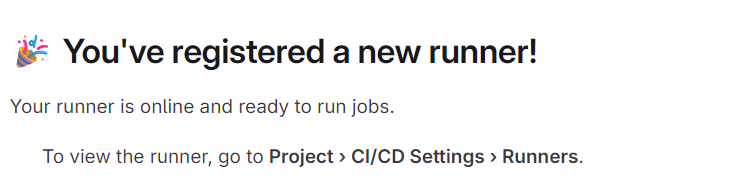

<br>

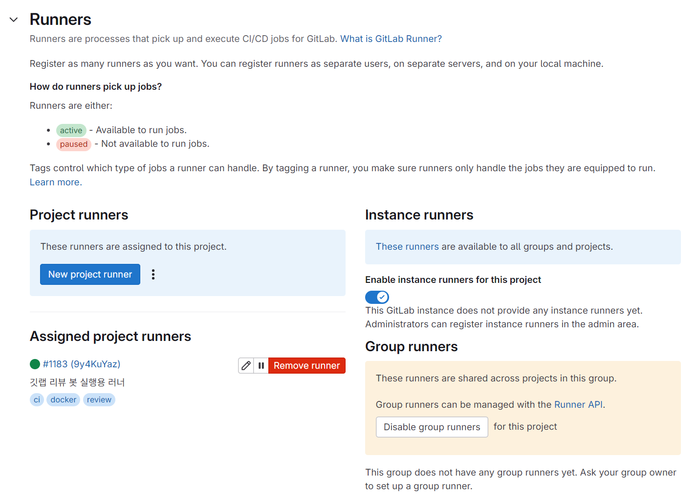

<br><br>

## 2. Gitlab Reposiotry 접근을 위한 AccessToken 발급

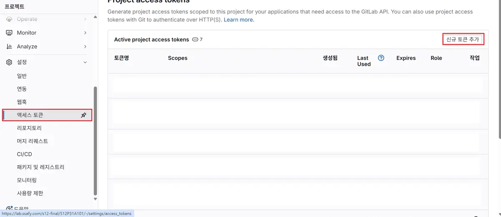

- Runner에서 Gitlab Repository에 접근하기 위한 엑세스 토큰 발급이 필요합니다.
- <code>Gitlab 설정 -> 엑세스 토큰 -> 신규 토큰 추가</code>를 통한 엑세스 토큰을 발급합니다.

<br><br>

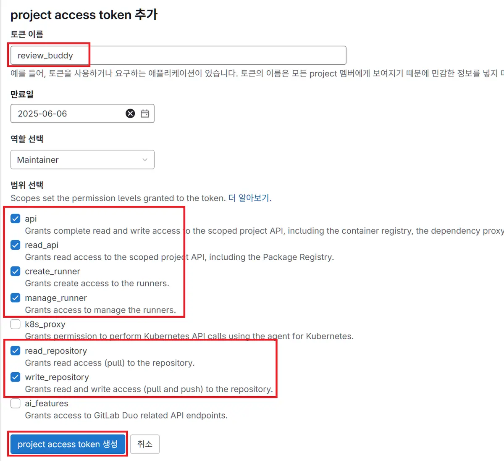

- 토큰 이름을 임의로 지정하고 그 외 토큰 정보를 선택하여 엑세스 토큰을 생성합니다.
- 생성된 엑세스 토큰 정보를 복사합니다.

<br><br>

## 3. Gitlab CI/CD Variables 등록

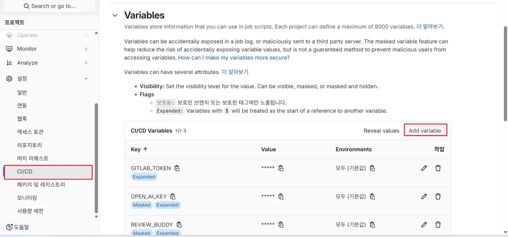

- 이후 Runner에서 코드 리뷰를 위한 환경 변수들을 등록해야합니다.
- <code>Gitlab 설정 -> CI/CD -> Variables -> Add variable</code>을 통해 <code>GITLAB_TOKEN</code>으로 저장합니다.

<br><br>

| 변수 이름        | 필수 | 용도 / 설명 | 비고 |
|-----------------|------|-------------|------|
| `GITLAB_TOKEN`  | ✅   | **API 스코프**가 포함된 Personal Access Token. MR diff 조회·코멘트 작성에 사용 | 프로젝트 Owner 계정으로 발급 권장 |
| `OPEN_AI_KEY`   | ▫️   | GPT-4o 리뷰를 사용할 때 입력하는 OpenAI API Key | Ollama만 쓸 경우 비워도 무방 |


- GPT 코드 리뷰를 희망한다면 GPT OPEN API Key를 <code>OPEN_AI_KEY</code>에 저장합니다. 초기 설정은 Gpt이므로 없으면 Pipeline 에러가 발생할 수 있으니, Ollama를 사용 희망시 [.gitlab-ci.yml](#4-gitlab-ci-파일-등록)를 수정해주세요.

<br><br>

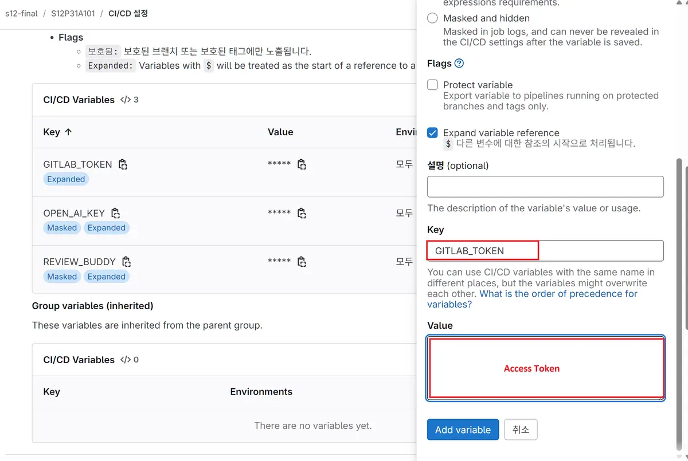

- Key 값은 위와 동일하게 각각 **<code>GITLAB_TOKEN</code>, <code>OPEN_AI_KEY</code>**로 지정하고, 토큰의 값 등록이 필요합니다.
    - Key의 값이 달라지면 오류가 발생합니다.

<br><br>

## 4. Gitlab CI 파일 등록

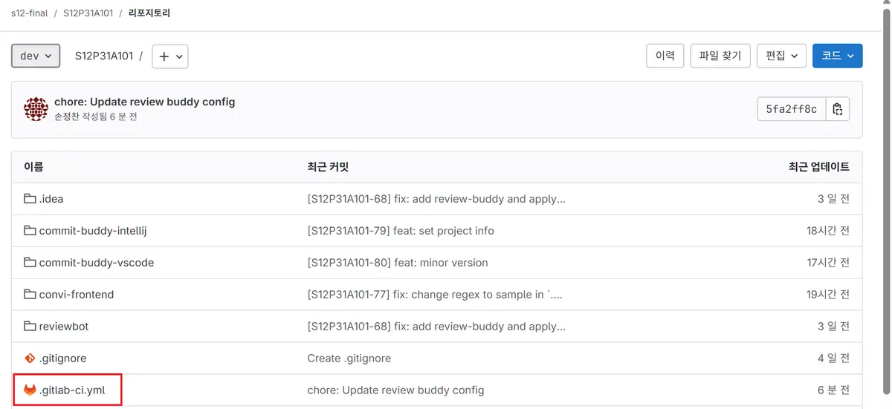

- 아래의 코드를 **.gitlab-ci.yml** 파일로 생성하고, Gitlab Repository 최상위 디렉토리에 넣어주세요.
    - 파일명은 반드시 '.gitlab-ci.yml'이여야 합니다.

```yml
stages:
  - review

variables:
  CI_PROJECT_ID: $CI_PROJECT_ID
  GITLAB_TOKEN: $GITLAB_TOKEN
  OPEN_AI_KEY: $OPEN_AI_KEY 

  REVIEW_MODEL: "OpenAI"
  # REVIEW_MODEL: "hf.co/Bllossom/llama-3.2-Korean-Bllossom-3B-gguf-Q4_K_M"
  RAG_FLAG: "rag"
  # RAG_FLAG: ""

mr_review:
  stage: review
  image: os2864/review-buddy:v0.1.6
  # image: os2864/review-buddy-gpt:v0.1.2
  only:
    - merge_requests
  script:
    - ollama serve &
    - python /app/review_buddy.py $REVIEW_MODEL $RAG_FLAG
```

<br><br>

### Gitlab CI 파일 설정

| 구분 | 키/값 | 필수 여부 | 역할 · 동작 | 비고 |
|------|-------|-----------|-------------|------|
| **환경 변수** | `GITLAB_TOKEN` | ✅ | MR diff 조회·코멘트 작성용 **Personal Access Token** | `api` scope 필요 |
| | `OPEN_AI_KEY` | 옵션 | GPT-4o 사용 시 OpenAI API Key | Ollama만 쓰면 빈 값 가능 |
| **LLM 선택** | `REVIEW_MODEL` | 기본=`OpenAI` | 리뷰에 사용할 LLM 종류 | `OpenAI` \| `llama3.2` |
| **RAG 사용 여부** | `RAG_FLAG` | 기본=`rag` | RAG 기반 컨텍스트 추가 여부 | `"rag"` \| `""` |

<br>

### REVIEW_MODEL

| REVIEW_MODEL 값 | 사용 LLM | 비고 |
|-----------------|----------|------|
| `OpenAI`        | **GPT Open API** | OpenAI API Key 필요 |
| `llama3.2`      | **Ollama 3.2** | 이미지에 Ollama 모델 사전 내장 |

<br>

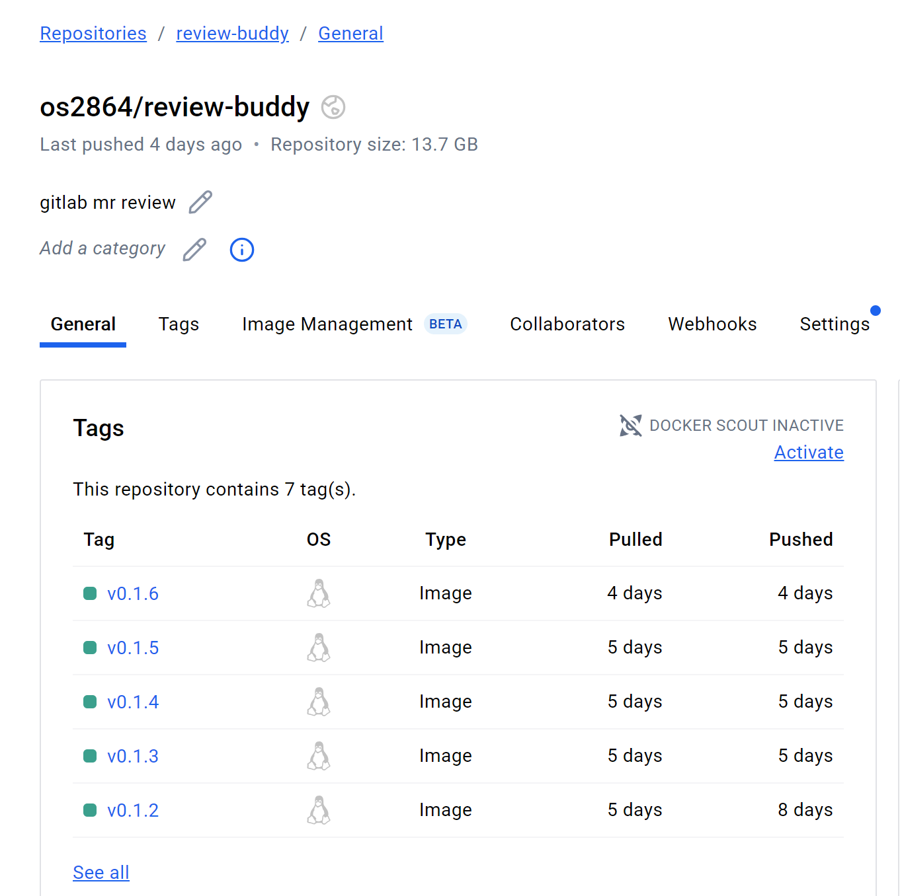

<br>

### Docker 이미지 목록
| Docker 이미지                           | 내장 LLM 구성                 | 최초 pull 용량(≈) | 용도 |
|----------------------------------------|------------------------------|------------------|------|
| `os2864/review-buddy-gpt:v0.1.2`       | GPT-1o 전용            | 226 MB           | **GPT-1o만** 사용하는 경우 추천하는 경량 이미지 |
| `os2864/review-buddy-gpt:v0.1.1`       | GPT-4o 전용            | 226 MB           | **GPT-4o만** 사용하는 경우 추천하는 경량 이미지 |
| `os2864/review-buddy:v0.1.6`           | Ollama 3.2 + GPT-1o    | 3.7 GB           | GPT-1o 또는 **Ollama 3.2** 사용할 수 있는 중량 이미지 |
| `os2864/review-buddy:v0.1.5`           | Ollama 3.2 + GPT-4o    | 3.7 GB           | GPT-4o 또는 **Ollama 3.2** 사용할 수 있는 중량 이미지 |

<br>

### RAG_FLAG 동작 차이

| RAG_FLAG 값 | 프롬프트에 포함되는 컨텍스트 |
|-------------|----------------------------|
| `"rag"` | 변경 코드 + **유사도 상위 5개** 코드 조각 |
| `""`(빈 값) | 변경 코드만 사용 |

---

<br>

## (선택)5. Docker Image 커스터마이징

```bash
FROM ubuntu:22.04

RUN apt-get update && apt-get install -y \
  curl \
  gnupg \
  ca-certificates \
  tar \
  python3 \
  python3-pip \
  coreutils \
  && rm -rf /var/lib/apt/lists/*

COPY requirements.txt .
RUN pip install --no-cache-dir -r requirements.txt

RUN curl -fsSL https://ollama.com/install.sh | bash

RUN ollama serve & \
  sleep 5 && \
  ollama pull llama3.2

RUN ln -s /usr/bin/python3 /usr/bin/python

WORKDIR /app
COPY review_buddy.py .
```

- `review-buddy` 기본 이미지는 review-buddy 디렉토리의 Dockerfile로 구성되어 있습니다.
- 하지만 팀마다 쓰는 **LLM, 라이브러리, 프롬프트** 가 다르기 때문에, 필요하다면 <code>Dockerfile</code>, <code>requirements.txt</code>, <code>review_buddy.py</code>를 수정해 **전용 이미지를 빌드**할 수 있습니다.

### 5-1. LLM 교체 / 추가 
- 모델 크기에 따라 베이스 이미지를 변경하여 용량을 줄이거나 다른 LLM을 사용할 수 있습니다.
- 예) `ollama pull mistral` 또는 `phi3:mini` 다운로드 명령을 Dockerfile에 추가  

<br>

### 5-2. 추가 패키지 / 도구 설치
- 필요한 공통 라이브러리 등을 requirements.txt에 명시하여 도구를 설치할 수 있습니다.
- 시스템 패키지가 필요하면 Dockerfile에서 `apt-get install jq`처럼 추가할 수 있습니다.

<br>

### 5-3. 프롬프트 및 리뷰 로직 수정  
- 유사도 탐색 개수(K)나 토큰 길이, AI 호출 모델명을 자유롭게 변경
- 예) `review_buddy.py`에서 `createPrompt()`를 변경하고 싶은 프롬프트로 수정 

<br>

### 5-4. 커스터마이징한 이미지 빌드 & 레지스트리 푸시  
```bash
docker build -t registry.example.com/review-buddy:1.0.0 .
docker push registry.example.com/review-buddy:1.0.0
```

<br>

### 5-5. 생성한 Image 사용으로 변경

```yml
mr_review:
  stage: review
  image: registry.example.com/review-buddy:1.0.0
```

- 이후 커스터마이징하여 저장된 이미지의 주소로 <code>.gitlab.yml</code>파일의 image: 값을 수정해주세요.