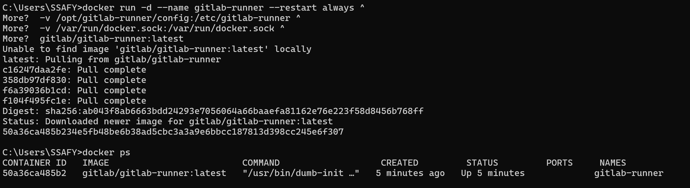
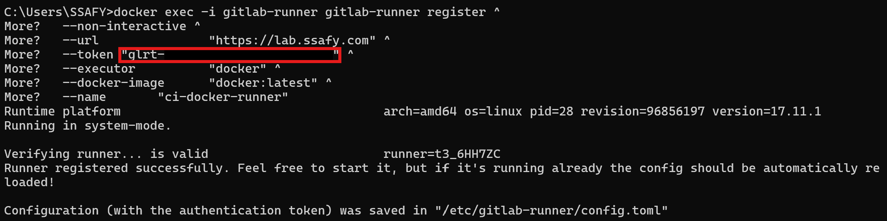

# Review Buddy (Gitlab MergeRequest AI Code Review)

### Review Buddy?
- **Review Buddy**는 **Gitlab MergerRequest** 요청 시 **Gitlab Request API, AI(Ollama, GPT)** 기반으로 자동 코드 리뷰를 작성하는 서비스입니다.
    - 해당 서비스를 적용하기 위해 **Gitlab Runner** 사전 작업이 필요하며, .gitlab-ci.yml를 프로젝트 루트에 위치시켜야 합니다.
- Gitlab Runner를 로컬 혹은 운영환경에서 동작시키고, 이후 .gitlab-ci.yml이 존재하는 Branch에서 MR 요청 시 Gitlab Pipeline을 통해 Docker Image를 실행시키며, 해당 Docker Image는 RAG 기반 AI 코드 리뷰를 제공합니다.

<br>

## Review Buddy 구성 요소
1. Gitlab Runner
2. .gitlab-ci.yml
3. review-buddy Docker Image

<br>

### Gitlab Runner?
<details>
<summary><b>설명</summary>

- Gitlab Runner는 Gitlab Pipeline에서 동작이 필요한 작업을 자동으로 실행하고, 해당 정보를 Gitlab으로 보내주는 역할을 합니다.
- 자동으로 AI 코드 리뷰를 하기 위해서는 작업을 진행할 Gitlab Runner가 **로컬 환경 혹은 운영 환경**에서 실행 중이어야 합니다.
    - 로컬 환경도 가능하지만 Gitlab Runner가 로컬 환경에서 실행되는 경우, 현재 로컬 환경이 실행되고 있지 않고 팀원이 MR 요청을 한다면 Gitlab Runner가 실행되는 로컬 환경이 제공되지 않아 실행되지 않아 운영 환경에서 실행하는 것을 권장합니다.
- 지속적인 코드 리뷰를 원한다면 특정 환경에서 Gitlab Runner를 지속적으로 실행되어야 합니다.
</details>

<br>

### .gitlab-ci.yml?
<details>
<summary><b>설명</summary>

- 해당 파일은 파이프라인 설계도로서 GitLab CI/CD가 **'어떤 작업(Job)을 언제, 어떤 Runner에서 실행할지'** 를 정의합니다.
- Gitlab CI 발생 시 자동으로 참조하며, **Gitlab CI/CD Variables** 환경 변수 정보를 주입할 수 있습니다.
- Gitlab에서 자동으로 '.gitlab-ci.yml'를 파싱하여 사전에 Gitlab CI/CD Variables에 등록한 **<code>GITLAB_TOKEN</code>, <code>OPEN_AI_KEY</code>, <code>REVIEW_BUDDY</code>** 환경 변수 정보들을 받아와 Public Docker Image를 실행시켜 코드 리뷰 정보를 응답받습니다.
- 약간의 설정 수정을 통해 LLM 모델을 **Ollama 혹은 GPT**를 사용하도록 선택하거나, **RAG 사용 여부**를 선택할 수 있습니다.
</details>

<br>

### Review Buddy Docker Image?
<details>
<summary><b>설명</summary>

- **LangChain 환경의 RAG 기반**으로 코드 리뷰 환경을 쉽게 구축하고, 실행하기 위해 Review Buddy는 **Public Docker Image**를 사용하여 AI 코드 리뷰를 진행합니다.
- 제공되는 Docker Image는 Gpt-4o Image, Ollama 3.2 + Gpt-4o Image를 선택할 수 있습니다.
    - **os2864/review-buddy:v0.1.3** : 중량급 LLM인 Ollama 3.2 + Gpt-4o 코드 리뷰 이미지 (3.76GB)
    - **os2864/review-buddy-gpt:v0.1.1** : Gpt-4o 경량 코드 리뷰 이미지 (226MB)
- 이미지 실행 시 각각 6 ~ 8GB, 300 ~ 500MB 으로 사용 시, Runner 실행 환경에서 처음 Pull시 해당 용량 만큼의 공간을 확보해야합니다.
- RAG는 **chromadb** 라이브러리를 사용하며, 저장된 임베딩 파일 중 **코사인 유사도 상위 5개**의 파일을 참조합니다.
</details>

<br>

### 동작 순서
1. Gitlab Runner를 로컬 환경 혹은 운영 환경에서 실행시킵니다.
2. 프로젝트 루트에 'gitlab-ci.yml'를 추가합니다.
3. Gitlab에서 CI 발생시 자동으로 '.gitlab-ci.yml'을 파싱하여 Pipeline 객체를 생성하며, 해당 객체 생성시 GitLab이 자동으로 객체 안에 Job N개를 ‘pending’ 상태로  'Pending-Job 대기열'에 집어넣습니다.
4. Gitlab Runner가 지속적인 Polling을 통해 Gitlab 대기열의 작업이 있다고 판단하면, 작업을 가져오고 상태를 'Running' 상태로 변경합니다.
5. '.gitlab-ci.yml' 설정에 맞게 Review Buddy Docker Image를 실행시키며 완료 시 응답을 반환합니다.
6. Gitlab Pipeline 성공시, 해당 MR에 리뷰가 성공적으로 작성됩니다.

<br>

## 사용 방법

### 1. Gitlab Runner 컨테이너 생성 및 실행

### 1-1. Runner 생성


- Gitlab Runner 생성을 위해 설정 -> CI/CD -> Runner -> New project runner 버튼을 클릭합니다.

<br>


- Runner 실행 태그를 등록합니다. 등록된 태그의 Job을 실행하기 위한 용도입니다.

<br>


- Docker Container에서 Runner를 실행한다면 Docker 실행 환경 플랫폼을 선택하고, Step1 코드 블록 내의 token 정보를 복사합니다. 해당 정보는 아래 **${gitlab_runner_token}** 값으로 사용됩니다.
  - Docker Desktop의 디폴트 실행환경은 Linux 입니다.
  - Docker Container를 사용한다면 컨테이너 생성 및 실행 명령어는 <b>[1-2](#1-2-runner-컨테이너-생성-및-실행), [1-3](#1-3-runner-정보-최초-등록)</b>에 존재합니다.
- 만약 Docker Container로 동작시키지 않는다면, OS 플랫폼을 선택하고 Gitlab 화면의 Step1, Step2의 명령어를 그대로 실행하면 됩니다.

<br>


### 1-2. Runner 컨테이너 생성 및 실행



- 해당 명령어를 Runner를 실행시킬 환경(로컬 혹은 운영 환경)에서 실행하여 Runner 컨테이너 생성 및 실행합니다. 사용 중인 터미널 환경에 따라 아래 명령어 중 하나를 실행하세요.
- 만약 위에서 컨테이너로 Runner를 실행하지 않고, OS에서 직접 실행한다면 해당 <b>[1-2](#1-2-runner-컨테이너-생성-및-실행), [1-3](#1-3-runner-정보-최초-등록)</b> 과정은 건너뜁니다.

<details>
<summary><b>Git Bash / WSL / Linux Bash / zsh 명령어</b></summary>

```bash
docker run -d --name gitlab-runner --restart always \
  -v /opt/gitlab-runner/config:/etc/gitlab-runner \
  -v /var/run/docker.sock:/var/run/docker.sock \
  gitlab/gitlab-runner:latest
```
</details>

<details>
<summary><b>Windows CMD 명령어</b></summary>

```bash
docker run -d --name gitlab-runner --restart always ^
  -v /opt/gitlab-runner/config:/etc/gitlab-runner ^
  -v /var/run/docker.sock:/var/run/docker.sock ^
  gitlab/gitlab-runner:latest
```
</details>

<br>

### 1-3. Runner 정보 최초 등록




- Runner를 Gitlab Repository와 연동하기 위한 최초 정보를 등록합니다. 사용 중인 터미널 환경에 따라 아래 명령어 중 하나를 실행하세요.
- 해당 명령어를 Runner를 실행시킬 환경에서 실행 시, **${gitlab_runner_token}** 의 값을 Gitlab Runner Token 값으로 변경해주세요.

<details>
<summary><b>Git Bash / WSL / Linux Bash / zsh 명령어</b></summary>

```bash
docker exec -i gitlab-runner gitlab-runner register \
  --non-interactive \
  --url               "https://lab.ssafy.com" \
  --token             "${gitlab_runner_token}" \
  --executor          "docker" \
  --docker-image      "docker:latest" \
  --name              "ci-docker-runner"
```
</details>

<details>
<summary><b>Windows CMD 명령어 명령어</b></summary>

```bash
docker exec -i gitlab-runner gitlab-runner register ^
  --non-interactive ^
  --url               "https://lab.ssafy.com" ^
  --token             "${gitlab_runner_token}" ^
  --executor          "docker" ^
  --docker-image      "docker:latest" ^
  --name              "ci-docker-runner"
```
</details>

<br>


<br>


<br>

## 2. Gitlab Reposiotry 접근을 위한 AccessToken 발급


- Runner에서 Gitlab Repository에 접근하기 위한 엑세스 토큰 발급이 필요합니다.
- Gitlab 설정 -> 엑세스 토큰 -> 신규 토큰 추가를 통한 엑세스 토큰을 발급합니다.

<br>


- 토큰 이름을 임의로 지정하고 그 외 토큰 정보를 선택하여 엑세스 토큰을 생성합니다.
- 생성된 엑세스 토큰 정보를 복사합니다.

<br>

## 3. Gitlab CI/CD Variables 등록


- 이후 Runner에서 코드 리뷰를 위한 환경 변수들을 등록해야합니다.
- Gitlab 설정 -> CI/CD -> Variables -> Add variable을 통해 <code>GITLAB_TOKEN</code>으로 저장합니다.
- GPT 코드 리뷰를 희망한다면 GPT OPEN API Key를 <code>OPEN_AI_KEY</code>에 Gpt Open 토큰을 저장합니다. 초기 설정은 Gpt로 되어있어 없으면 Pipeline 에러가 발생하며, Ollama를 사용 희망시 ['.gitlab-ci.yml'](4-gitlab-ci-파일-등록)를 수정해주세요

<br>


- Key 값은 위와 동일하게 각각 **GITLAB_TOKEN, OPEN_AI_KEY**로 지정하고, 토큰의 값 등록이 필요합니다.
    - Key의 값이 달라지면 오류가 발생합니다.

<br>

## 4. Gitlab CI 파일 등록


- 아래의 코드를 **.gitlab-ci.yml** 파일로 생성하고, Gitlab Repository 최상위 디렉토리에 넣어주세요.
    - 파일명은 반드시 '.gitlab-ci.yml'이여야 합니다.

```yml
stages:
  - review

variables:
  CI_PROJECT_ID: $CI_PROJECT_ID
  GITLAB_TOKEN: $GITLAB_TOKEN
  OPEN_AI_KEY: $OPEN_AI_KEY 

  REVIEW_MODEL: "OpenAI"   # llama3.2
  RAG_FLAG: "rag"    # ""

mr_review:
  stage: review
  image: os2864/review-buddy:v0.1.3 # "os2864/review-buddy-gpt:v0.1.1"
  only:
    - merge_requests
  script:
    - ollama serve &
    - python /app/review_buddy.py $REVIEW_MODEL $RAG_FLAG
```

<br>

### 4-1. Gitlab CI 파일 설정

- 해당 yml에서 REVIEW_MODEL 종류는 다음과 같습니다.
    - "OpenAI" : Gpt-4o
    - "llama3.2" : Ollama 3.2
- 해당 yml에서 RAG_FLAG를 통해 관련 코드 RAG 여부를 선택할 수 있습니다.
    - "rag" : RAG 기반으로 동작하여 관련도가 높은 상위 5개의 임베딩 파일과 MR 코드 변경사항을 프롬프트에 추가합니다.
    - "" : MR 코드 변경사항만을 프롬프트에 추가합니다.
- GPT 만을 사용한 AI 리뷰를 희망하신다면 경량화된 이미지를 선택할 수 있습니다. 현재 제공되는 도커 이미지 종류는 다음과 같습니다.
    - "os2864/review-buddy:v0.1.3" : Gpt, Ollama LLM 모두 사용하는 컨테이너 생성
    - "os2864/review-buddy-gpt:v0.1.1" : Gpt LLM 만을 사용하는 경량 이미지